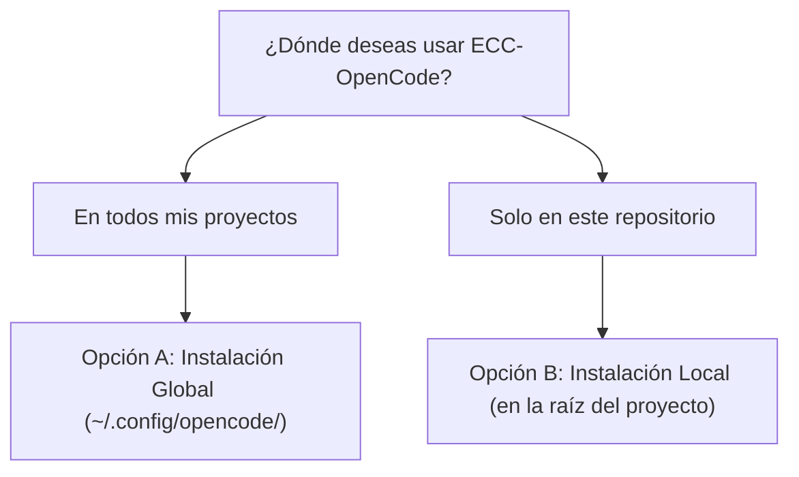
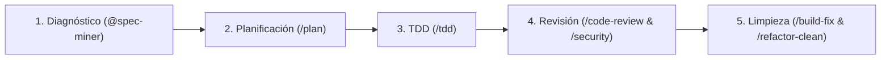

# Guía de Instalación y Uso de ECC-OpenCode en Proyectos Existentes

Esta guía explica detalladamente cómo integrar y aprovechar **ECC-OpenCode v1.0.0** (impulsado por **Bun** y optimizado para **OpenCode**) para auditar, refactorizar y añadir nuevas funcionalidades a un proyecto existente (brownfield).

---

## 1. Métodos de Integración

OpenCode permite dos formas de utilizar ECC-OpenCode: **global** (disponible para todos los proyectos en tu máquina) o **por proyecto** (acoplado a un repositorio específico).



---

### Opción A: Instalación Global (Recomendada)

OpenCode lee por defecto la configuración del usuario en `~/.config/opencode/`. Al registrar los subagentes, comandos y skills en esa ubicación, **cualquier proyecto donde ejecutes `opencode` tendrá acceso automático** a los 68 subagentes, 100 comandos slash y 292 skills.

Ejecuta los siguientes comandos en tu terminal:

```bash
# 1. Asegurar directorios globales de OpenCode
mkdir -p ~/.config/opencode/agents ~/.config/opencode/commands

# 2. Copiar los subagentes y comandos desde ECC-OpenCode
cp -r /home/anibalgh/Desarrollos/ECC-OpenCode/.opencode/agents/* ~/.config/opencode/agents/
cp -r /home/anibalgh/Desarrollos/ECC-OpenCode/.opencode/commands/* ~/.config/opencode/commands/

# 3. Crear o actualizar ~/.config/opencode/opencode.json con la ruta a los skills y plugins
cat << 'EOF' > ~/.config/opencode/opencode.json
{
  "$schema": "https://opencode.ai/config.json",
  "skills": {
    "paths": [
      "/home/anibalgh/Desarrollos/ECC-OpenCode/skills",
      "/home/anibalgh/Desarrollos/ECC-OpenCode/.agents/skills"
    ]
  },
  "plugin": [
    "/home/anibalgh/Desarrollos/ECC-OpenCode/.opencode/dist"
  ]
}
EOF
```

> [!TIP]
> Con la instalación global, no necesitas modificar nada dentro de tus proyectos existentes. Simplemente entras a cualquier repositorio (`cd ~/mi-proyecto`) y ejecutas `opencode`.

---

### Opción B: Instalación Local en un Proyecto Específico

Utiliza este método si deseas versionar la configuración de OpenCode en el repositorio de tu proyecto o si trabajas en equipo y deseas que todos los colaboradores compartan las mismas instrucciones y agentes.

1. **Copiar las instrucciones y la carpeta `.opencode` a tu proyecto**:
   ```bash
   cd /ruta/a/tu-proyecto-existente

   # 1. Copiar las instrucciones del sistema (AGENTS.md)
   cp /home/anibalgh/Desarrollos/ECC-OpenCode/AGENTS.md ./

   # 2. Copiar los agentes y comandos
   mkdir -p .opencode
   cp -r /home/anibalgh/Desarrollos/ECC-OpenCode/.opencode/agents .opencode/
   cp -r /home/anibalgh/Desarrollos/ECC-OpenCode/.opencode/commands .opencode/
   ```

2. **Crear el archivo `opencode.json` en la raíz de tu proyecto**:
   ```json
   {
     "$schema": "https://opencode.ai/config.json",
     "default_agent": "build",
     "skills": {
       "paths": [
         "/home/anibalgh/Desarrollos/ECC-OpenCode/skills"
       ]
     },
     "plugin": [
       "/home/anibalgh/Desarrollos/ECC-OpenCode/.opencode/dist"
     ]
   }
   ```

---

## 2. Flujo de Trabajo para Mejorar un Proyecto Existente

Una vez configurado, entra a la raíz de tu proyecto existente e inicia OpenCode:

```bash
cd /ruta/a/tu-proyecto-existente
opencode
```

Para mantener la máxima estabilidad y evitar regresiones, sigue este ciclo de desarrollo recomendado:



---

### Paso 1: Onboarding y Diagnóstico del Código Existente

Antes de pedirle a la IA que realice cambios mayores, permite que extraiga el contexto real de tu arquitectura:

- **Extraer especificación y límites arquitectónicos**:
  Invoca al subagente `@spec-miner`:
  ```text
  @spec-miner analiza este repositorio existente, extrae la especificación actual, la arquitectura de capas y los límites de las pruebas existentes.
  ```
- **Auditar la configuración del harness**:
  ```text
  /harness-audit
  ```

---

### Paso 2: Planificar Mejoras antes de tocar Código

> [!IMPORTANT]
> **Nunca modifiques código a ciegas en un proyecto en producción.** El comando `/plan` obliga a la IA a analizar dependencias y diseñar una estrategia por fases, esperando tu aprobación explícita antes de editar archivos.

Ejemplo:
```text
/plan "Necesito refactorizar el servicio de pagos para soportar webhooks asíncronos y reintentos con Redis"
```

El subagente `planner` evaluará riesgos, propondrá fases y te preguntará:
`WAITING FOR CONFIRMATION: Proceed with this plan? (yes/no/modify)`

Responde con `yes` o `proceder` únicamente cuando estés conforme con la estrategia.

---

### Paso 3: Implementar con TDD (Test-Driven Development)

Para garantizar que el nuevo código funcione y no rompa funcionalidades previas, utiliza el comando `/tdd`:

```text
/tdd "Implementar la lógica de reintentos con backoff exponencial para pagos"
```

El subagente `tdd-guide` aplicará el ciclo obligatorio:
1. **RED**: Escribe primero el test unitario y comprueba que falle.
2. **GREEN**: Escribe la implementación mínima para que el test pase.
3. **IMPROVE**: Refactoriza el código asegurando una cobertura mínima del 80%.

---

### Paso 4: Revisión Automática de Calidad y Seguridad

Antes de hacer `git commit`, corre las revisiones automáticas sobre tus cambios recientes (`git diff`):

- **Revisión de calidad y estilo de código**:
  ```text
  /code-review
  ```
- **Revisiones especializadas por lenguaje**:
  - Proyectos Python / Django / FastAPI: `/python-review` o `/fastapi-review`
  - Proyectos React / Next.js / TypeScript: `/react-review`
  - Proyectos Go: `/go-review`
  - Proyectos Rust: `/rust-review`
  - Proyectos C/C++: `/cpp-review`
  - Proyectos Kotlin / Android: `/kotlin-review`
- **Auditoría de seguridad y vulnerabilidades**:
  ```text
  /security
  ```
  *(El subagente `security-reviewer` analiza inyecciones SQL/NoSQL, validación de schemas con Zod/Pydantic, CORS, manejo de tokens y previene fugas de credenciales).*

---

### Paso 5: Corrección de Errores y Limpieza

- **Si falla la compilación o el tipado**:
  ```text
  /build-fix
  ```
  *(El subagente `build-error-resolver` aplicará diffs mínimos y quirúrgicos para resolver errores de compilador o TypeScript).*
- **Eliminar código muerto tras el refactor**:
  ```text
  /refactor-clean
  ```
  *(Elimina imports no utilizados, funciones huérfanas y código duplicado).*

---

## 3. Ejemplo Práctico de Sesión en Vivo

```bash
$ cd ~/mis-proyectos/tienda-api
$ opencode

# 1. Planificar la tarea
> /plan Migrar las consultas SQL directas a Prisma ORM en el módulo de usuarios

# El agente planner responde con las fases de migración y solicita tu visto bueno:
# ¿Deseas proceder con la Fase 1?
> yes

# 2. Implementar los tests y el repositorio
> /tdd Crear e implementar UserRepository con Prisma

# 3. Revisar calidad y seguridad antes de confirmar cambios
> /code-review
> /security

# 4. Verificar compilación
> /build-fix
```

Siguiendo esta metodología con **ECC-OpenCode**, evolucionarás cualquier base de código existente con estándares profesionales de ingeniería de software, seguridad proactiva y cobertura de pruebas garantizada.
