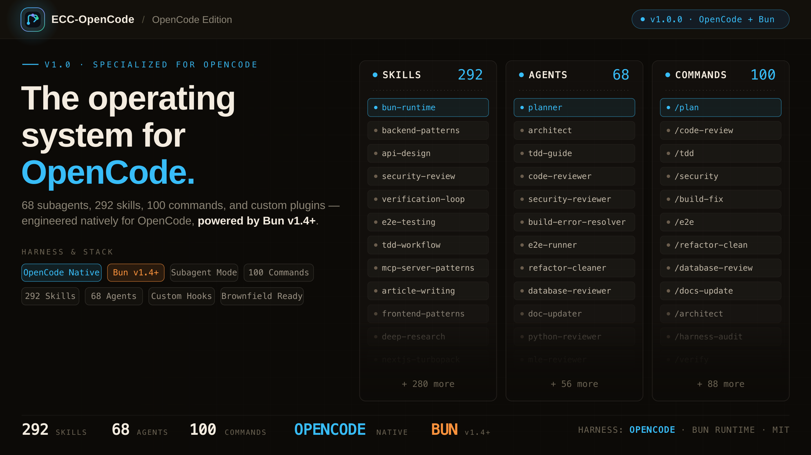

<p align="center">
  
</p>

<p align="center">
  
  
  
  
  
  
  <a href="LICENSE"></a>
</p>

---

# ECC-OpenCode (v1.0.0)

> **Production-ready AI coding operating system specialized for the [OpenCode](https://opencode.ai) harness and powered by [Bun](https://bun.sh).**

**ECC-OpenCode** brings the full engineering discipline of Everything Claude Code directly into OpenCode: planning before coding, strict Test-Driven Development (TDD $\ge 80\%$), automated code & security reviews, build repair, 68 domain subagents, 100 slash commands, 292 skills, and 15+ event-driven plugin hooks.

```text
plan ──> test (TDD) ──> implement ──> review ──> verify ──> remember ──> improve
```

---

## Prerequisites

Before starting, ensure you have **Bun** and **OpenCode CLI** installed:

1. **Bun** (v1.1+ or v1.4+ recommended):
   ```bash
   curl -fsSL https://bun.sh/install | bash
   ```
2. **OpenCode CLI** (v1.18+ or v2.x):
   ```bash
   # Install via Bun (recommended)
   bun install -g --trust @opencode/cli
   
   # Or via curl
   curl -fsSL https://opencode.ai/v2/install | bash
   ```

---

## Installation & Quickstart

### 1. Clone & Install Dependencies

Clone this repository and install dependencies in milliseconds using Bun:

```bash
git clone git@github.com:anibalgh/ECC-OpenCode.git
cd ECC-OpenCode
bun install
```

### 2. Build the OpenCode Plugin

Compile the OpenCode plugin hooks and custom tools:

```bash
bun run build:opencode
```

### 3. Launch OpenCode

Start OpenCode in your preferred interface:

```bash
# Terminal TUI
opencode

# Web UI (pair mode)
opencode pair

# Desktop app
opencode desktop
```

OpenCode automatically discovers and loads:
- **Project Configuration**: `opencode.json` and `.opencode/opencode.json`
- **Persistent Instructions**: `AGENTS.md`
- **68 Subagents**: discovered directly from `.opencode/agents/*.md`
- **100 Slash Commands**: discovered from `.opencode/commands/*.md`
- **292 Agent Skills**: registered via `"skills": { "paths": ["./skills"] }` and loaded on demand
- **Plugin Hooks & Tools**: `.opencode/plugins/` (precompiled in `.opencode/dist/`)

> [!TIP]
> **Existing Projects**: To integrate and use ECC-OpenCode with an existing project on your machine, see the complete step-by-step guide in [INSTALACION.md](INSTALACION.md).

---

## What is Included

| Component | Count | Description |
| :--- | :---: | :--- |
| **Specialized Subagents** | **68** | Planning, architecture, TDD, code review, security, build error resolvers, and language specialists |
| **Slash Commands** | **100** | Interactive shortcuts for `/plan`, `/tdd`, `/code-review`, `/security`, `/build-fix`, etc. |
| **Agent Skills** | **292** | On-demand knowledge packs for APIs, frameworks, databases, and DevOps via the `skill` tool |
| **Plugin Hooks** | **15+** | Lifecycle events for auto-formatting, type-checking, secret prevention, and context compaction |
| **Custom Tools** | **8** | `changed-files`, `dependency-analyzer`, `run-tests`, `check-coverage`, `security-audit`, etc. |

---

## How to Use ECC-OpenCode

### 1. Invocating Subagents (`@<agent>`)

Delegate complex tasks to specialized agents directly in your prompt or with the `subagent` tool:

- `@planner`: Create a step-by-step phased implementation plan before writing code.
- `@tdd-guide`: Enforce test-driven development (RED $\rightarrow$ GREEN $\rightarrow$ REFACTOR) with 80%+ coverage.
- `@code-reviewer`: Review recent git diffs for maintainability, immutability, and code style.
- `@security-reviewer`: Audit authentication, input validation, and credential leaks.
- `@build-error-resolver`: Fix build and type errors with minimal, focused diffs.
- `@python-reviewer` / `@react-reviewer` / `@go-reviewer` / `@rust-reviewer`: Language-specific review.

### 2. Using Slash Commands (`/<command>`)

Type `/` in the OpenCode composer to view all 100 available commands:

```text
/plan "Implement user session management with JWT and Redis"
/tdd "Add unit tests for payment processing module"
/code-review
/security
/build-fix
/e2e
/refactor-clean
/python-review
```

### 3. On-Demand Skills

OpenCode automatically loads skills dynamically via the native `skill` tool:
- When building APIs $\rightarrow$ loads `api-design`
- When optimizing backend $\rightarrow$ loads `backend-patterns`
- When writing E2E tests $\rightarrow$ loads `e2e-testing`
- When performing security audits $\rightarrow$ loads `security-review`

### 4. Any Model, Any Provider

Unlike Claude Code, OpenCode is model-agnostic. You can connect and switch models at runtime:
- **Anthropic**: Claude 3.7 Sonnet, Claude 3.5 Sonnet, Claude 3.5 Haiku
- **OpenAI**: GPT-4o, o1, o3-mini
- **Google**: Gemini 2.0 Flash / Pro
- **Local & Open Models**: Ollama, DeepSeek R1, vLLM
- Run `/connect` or `opencode providers` to configure your credentials.

---

## Development & Maintenance Scripts

All scripts are powered by **Bun**:

```bash
# Rebuild OpenCode plugin payload
bun run build:opencode

# Run all test suites
bun test

# Validate OpenCode configuration
bun tests/opencode-config.test.js

# Verify plugin build output
bun tests/scripts/build-opencode.test.js
```

---

## Installation & Setup Options

ECC-OpenCode is designed for two main scenarios:

### Option A: Standalone Workspace (New Project)
If you are starting a new project or using ECC-OpenCode as your development repository:

1. Clone and install dependencies with Bun:
   ```bash
   git clone git@github.com:anibalgh/ECC-OpenCode.git
   cd ECC-OpenCode
   bun install
   ```

2. Build the OpenCode plugin payload:
   ```bash
   bun run build:opencode
   ```

3. Launch OpenCode:
   ```bash
   opencode
   ```

### Option B: Integrating with an Existing Project (Brownfield)
If you already have an existing project repository and want to equip it with ECC-OpenCode's subagents, commands, skills, and TDD workflow:

- **Quick Setup**: Copy `.opencode/` and `AGENTS.md` to your project root.
- **Global Setup**: Configure `~/.opencode/` to provide ECC subagents and tools across all projects on your machine.
- **Detailed Step-by-Step Guide**: See the dedicated [INSTALACION.md](INSTALACION.md) for full instructions on setup, model configuration, and team adoption.

---

## Configuration (`opencode.json`)

OpenCode projects configure instructions, skills, and plugins in `opencode.json`:

```json
{
  "$schema": "https://opencode.ai/config.json",
  "instructions": [
    "AGENTS.md"
  ],
  "skills": {
    "paths": [
      "./skills"
    ]
  },
  "plugin": [
    "./.opencode/dist/plugin.js"
  ]
}
```

- **`instructions`**: Defines the operating system, TDD requirements, and delegation protocols.
- **`skills`**: Registers skill paths for dynamic, on-demand loading via the `skill` tool.
- **`plugin`**: Hooks for automated code formatting, type checking, security checks, and context preservation.


## Start Using ECC-OpenCode

Start with the workflow you need:

| What you are doing | OpenCode Workflow | Agent Used |
|---|---|---|
| **Building a feature** | `/plan "describe feature"`, then `/tdd` | `@planner`, `@tdd-guide` |
| **Fixing a bug** | Reproduce with a failing test, then `/tdd` | `@tdd-guide` |
| **Reviewing new code** | `/code-review` | `@code-reviewer` |
| **Repairing a build** | `/build-fix` | `@build-error-resolver` |
| **Cleaning & refactoring** | `/refactor-clean` | `@refactor-cleaner` |
| **Security audit** | `/security` or `/security-scan` | `@security-reviewer` |
| **E2E browser tests** | `/e2e` | `@e2e-runner` |
| **Updating documentation** | `/update-docs` | `@doc-updater` |

<details>
<summary><strong>Which agent should I use?</strong></summary>

Delegate to specialized subagents directly in OpenCode with `@<agent>` or the `subagent` tool:

| I want to... | Slash Command | Agent |
|---|---|---|
| Plan a new feature | `/plan "Add auth"` | `@planner` |
| Design system architecture | `/plan` + architect | `@architect` |
| Write code with tests first | `/tdd` | `@tdd-guide` |
| Review code just written | `/code-review` | `@code-reviewer` |
| Fix a failing build | `/build-fix` | `@build-error-resolver` |
| Run end-to-end tests | `/e2e` | `@e2e-runner` |
| Find security vulnerabilities | `/security` | `@security-reviewer` |
| Remove dead code | `/refactor-clean` | `@refactor-cleaner` |
| Update documentation | `/update-docs` | `@doc-updater` |
| Review Go code | `/go-review` | `@go-reviewer` |
| Review Python code | `/python-review` | `@python-reviewer` |
| Review TypeScript code | `/review` | `@typescript-reviewer` |
| Review Java / Spring Boot code | `/review` | `@java-reviewer` |
| Review Rust code | `/review` | `@rust-reviewer` |
| Review production ML / RAG | `/review` | `@mle-reviewer` |

</details>

<details>
<summary><strong>Common workflows</strong></summary>

**Starting a new feature:**
```text
/plan "Add user authentication with OAuth"   -> @planner creates implementation blueprint
/tdd "Implement user authentication"         -> @tdd-guide enforces write-tests-first
/code-review                                 -> @code-reviewer checks your work
```

**Fixing a bug:**
```text
/tdd "Reproduce auth token expiration bug"   -> @tdd-guide: write failing test (RED)
                                             -> implement fix, verify test passes (GREEN)
/code-review                                 -> @code-reviewer: catch regressions
```

**Preparing for production:**
```text
/security                                    -> @security-reviewer: OWASP Top 10 audit
/e2e                                         -> @e2e-runner: critical user flow tests
/test-coverage                               -> verify 80%+ coverage
```
</details>

## Model Selection & Providers

OpenCode is model-agnostic and connects to any LLM provider without vendor lock-in:

### 1. Cloud Providers
Set credentials via environment variables or use the `/connect` command in OpenCode:
- **Anthropic**: Claude 3.7 Sonnet, Claude 3.5 Sonnet, Claude 3.5 Haiku (`ANTHROPIC_API_KEY`)
- **OpenAI**: GPT-4o, o1, o3-mini (`OPENAI_API_KEY`)
- **Google**: Gemini 2.0 Flash / Pro (`GEMINI_API_KEY`)

Switch models on the fly in the OpenCode composer:
```text
/model claude-3-7-sonnet
/model gpt-4o
/model gemini-2.0-flash
```

### 2. Local & Self-Hosted Models
Run open-weight models (DeepSeek R1, Llama 3, Qwen 2.5) locally using Ollama or vLLM:
- **Ollama**: Configure `"model": "ollama/deepseek-r1"` in `opencode.json`
- **vLLM / Custom Gateways**: Point `OPENAI_BASE_URL` to your custom endpoint:
  ```bash
  export OPENAI_BASE_URL="https://your-gateway.example.com/v1"
  export OPENAI_API_KEY="your-token"
  ```

---

## What's New in v1.0.0

Current release: **1.0.0** (2026-09-24). Highlights:

- **OpenCode Specialization**: Fully optimized for OpenCode v1.18+ and v2.x architecture.
- **Bun Native**: High-speed package management, bundling, and testing powered by Bun v1.4+.
- **68 Subagents**: Granular subagent roles configured in `.opencode/agents/`.
- **100 Slash Commands**: Ready-to-use workflows in `.opencode/commands/`.
- **Dynamic Skills Integration**: 292 skills indexed and loaded on demand via OpenCode's native skill mechanism.
- **Compiled Plugin Hooks**: Event-driven hooks precompiled into `.opencode/dist/plugin.js`.
- **Brownfield Guide**: Complete documentation for integrating with existing codebases in [INSTALACION.md](INSTALACION.md).

Full history: [CHANGELOG.md](CHANGELOG.md).

---

## What's Inside

```text
ECC-OpenCode/
├── .opencode/             # OpenCode harness configuration
│   ├── agents/            # 68 specialized subagents (.md)
│   ├── commands/          # 100 slash commands (.md)
│   ├── plugins/           # Custom tools and event-driven hooks (TS/JS)
│   ├── dist/              # Precompiled plugin bundle
│   └── opencode.json      # Harness configuration
├── AGENTS.md              # Core operating rules and workflow OS
├── opencode.json          # Root configuration for OpenCode
├── INSTALACION.md         # Guide for new and brownfield projects
├── skills/                # 292 reusable skill modules loaded on demand
├── rules/                 # Engineering standards (common, TS, Python, Go, etc.)
├── scaffolds/             # Project starter templates
├── tests/                 # OpenCode plugins, tools, and config test suite
├── docs/                  # In-depth architectural guides and references
└── package.json           # Bun scripts and workspace dependencies
```

The root is the source of truth. Platform adapters package or map these same workflows instead of maintaining separate copies.

<details>
<summary><strong>Annotated component catalog</strong></summary>

```
ECC-OpenCode/
|-- .opencode/        # OpenCode plugins, tools, subagents, and commands
|   |-- agents/       # 68 specialized subagents
|   |-- commands/     # 100 slash commands
|   |-- plugins/      # Pre/post-execution hooks and custom tools
|   |-- dist/         # Compiled plugin bundle
|
|-- agents/           # 68 specialized subagents for delegation
|   |-- planner.md           # Feature implementation planning
|   |-- architect.md         # System design decisions
|   |-- tdd-guide.md         # Test-driven development
|   |-- code-reviewer.md     # Quality and security review
|   |-- security-reviewer.md # Vulnerability analysis
|   |-- build-error-resolver.md
|   |-- e2e-runner.md        # Playwright E2E testing
|   |-- refactor-cleaner.md  # Dead code cleanup
|   |-- doc-updater.md       # Documentation sync
|   |-- docs-lookup.md       # Documentation/API lookup
|   |-- chief-of-staff.md    # Communication triage and drafts
|   |-- loop-operator.md     # Autonomous loop execution
|   |-- harness-optimizer.md # Harness config tuning
|   |-- cpp-reviewer.md      # C++ code review
|   |-- cpp-build-resolver.md # C++ build error resolution
|   |-- fsharp-reviewer.md   # F# functional code review
|   |-- go-reviewer.md       # Go code review
|   |-- go-build-resolver.md # Go build error resolution
|   |-- python-reviewer.md   # Python code review
|   |-- database-reviewer.md # Database/Supabase review
|   |-- typescript-reviewer.md # TypeScript/JavaScript code review
|   |-- java-reviewer.md     # Java/Spring Boot code review
|   |-- java-build-resolver.md # Java/Maven/Gradle build errors
|   |-- kotlin-reviewer.md   # Kotlin/Android/KMP code review
|   |-- kotlin-build-resolver.md # Kotlin/Gradle build errors
|   |-- harmonyos-app-resolver.md # HarmonyOS/ArkTS app development
|   |-- rust-reviewer.md     # Rust code review
|   |-- rust-build-resolver.md # Rust build error resolution
|   |-- pytorch-build-resolver.md # PyTorch/CUDA training errors
|   |-- mle-reviewer.md      # Production ML pipeline, eval, serving, and monitoring review
|
|-- skills/           # Workflow definitions and domain knowledge
|   |-- coding-standards/           # Language best practices
|   |-- clickhouse-io/              # ClickHouse analytics, queries, data engineering
|   |-- backend-patterns/           # API, database, caching patterns
|   |-- frontend-patterns/          # React, Next.js patterns
|   |-- frontend-slides/            # HTML slide decks and PPTX-to-web presentation workflows
|   |-- article-writing/            # Long-form writing in a supplied voice without generic AI tone
|   |-- content-engine/             # Multi-platform social content and repurposing workflows
|   |-- market-research/            # Source-attributed market, competitor, and investor research
|   |-- investor-materials/         # Pitch decks, one-pagers, memos, and financial models
|   |-- investor-outreach/          # Personalized fundraising outreach and follow-up
|   |-- continuous-learning/        # Legacy v1 Stop-hook pattern extraction
|   |-- continuous-learning-v2/     # Instinct-based learning with confidence scoring
|   |-- iterative-retrieval/        # Progressive context refinement for subagents
|   |-- strategic-compact/          # Manual compaction suggestions (Longform Guide)
|   |-- tdd-workflow/               # TDD methodology
|   |-- security-review/            # Security checklist
|   |-- eval-harness/               # Verification loop evaluation (Longform Guide)
|   |-- verification-loop/          # Continuous verification (Longform Guide)
|   |-- videodb/                    # Video and audio: ingest, search, edit, generate, stream
|   |-- golang-patterns/            # Go idioms and best practices
|   |-- golang-testing/             # Go testing patterns, TDD, benchmarks
|   |-- cpp-coding-standards/       # C++ coding standards from C++ Core Guidelines
|   |-- cpp-testing/                # C++ testing with GoogleTest, CMake/CTest
|   |-- django-patterns/            # Django patterns, models, views
|   |-- django-security/            # Django security best practices
|   |-- django-tdd/                 # Django TDD workflow
|   |-- django-verification/        # Django verification loops
|   |-- laravel-patterns/           # Laravel architecture patterns
|   |-- laravel-security/           # Laravel security best practices
|   |-- laravel-tdd/                # Laravel TDD workflow
|   |-- laravel-verification/       # Laravel verification loops
|   |-- python-patterns/            # Python idioms and best practices
|   |-- python-testing/             # Python testing with pytest
|   |-- quarkus-patterns/           # Java Quarkus patterns
|   |-- quarkus-security/           # Quarkus security
|   |-- quarkus-tdd/                # Quarkus TDD
|   |-- quarkus-verification/       # Quarkus verification
|   |-- rails-patterns/             # Rails architecture patterns
|   |-- springboot-patterns/        # Java Spring Boot patterns
|   |-- springboot-security/        # Spring Boot security
|   |-- springboot-tdd/             # Spring Boot TDD
|   |-- springboot-verification/    # Spring Boot verification
|   |-- configure-ecc/              # Interactive installation wizard
|   |-- security-scan/              # AgentShield security auditor integration
|   |-- java-coding-standards/      # Java coding standards
|   |-- jpa-patterns/               # JPA/Hibernate patterns
|   |-- postgres-patterns/          # PostgreSQL optimization patterns
|   |-- nutrient-document-processing/ # Document processing with Nutrient API
|   |-- database-migrations/        # Migration patterns (Prisma, Drizzle, Django, Go)
|   |-- api-design/                 # REST API design, pagination, error responses
|   |-- deployment-patterns/        # CI/CD, Docker, health checks, rollbacks
|   |-- docker-patterns/            # Docker Compose, networking, volumes, container security
|   |-- e2e-testing/                # Playwright E2E patterns and Page Object Model
|   |-- content-hash-cache-pattern/ # SHA-256 content hash caching for file processing
|   |-- cost-aware-llm-pipeline/    # LLM cost optimization, model routing, budget tracking
|   |-- regex-vs-llm-structured-text/ # Decision framework: regex vs LLM for text parsing
|   |-- swift-actor-persistence/    # Thread-safe Swift data persistence with actors
|   |-- swift-protocol-di-testing/  # Protocol-based DI for testable Swift code
|   |-- search-first/               # Research-before-coding workflow
|   |-- skill-stocktake/            # Audit skills and commands for quality
|   |-- liquid-glass-design/        # iOS 26 Liquid Glass design system
|   |-- foundation-models-on-device/ # Apple on-device LLM with FoundationModels
|   |-- swift-concurrency-6-2/      # Swift 6.2 Approachable Concurrency
|   |-- mle-workflow/               # Production ML data contracts, evals, deployment, monitoring
|   |-- perl-patterns/              # Modern Perl 5.36+ idioms and best practices
|   |-- perl-security/              # Perl security patterns, taint mode, safe I/O
|   |-- perl-testing/               # Perl TDD with Test2::V0, prove, Devel::Cover
|   |-- autonomous-loops/           # Autonomous loop patterns: sequential pipelines, PR loops, DAG orchestration
|   |-- plankton-code-quality/      # Write-time code quality enforcement with Plankton hooks
|   |-- codehealth-mcp/             # Optional CodeScene Code Health MCP skill (opt-in)
|   |-- docs/examples/project-guidelines-template.md  # Template for project-specific skills
|
|-- commands/         # Maintained slash-entry compatibility; prefer skills/
|   |-- plan.md             # /plan - Implementation planning
|   |-- code-review.md      # /code-review - Quality review
|   |-- build-fix.md        # /build-fix - Fix build errors
|   |-- refactor-clean.md   # /refactor-clean - Dead code removal
|   |-- quality-gate.md     # /quality-gate - Verification gate
|   |-- learn.md            # /learn - Extract patterns mid-session (Longform Guide)
|   |-- learn-eval.md       # /learn-eval - Extract, evaluate, and save patterns
|   |-- checkpoint.md       # /checkpoint - Save verification state (Longform Guide)
|   |-- setup-pm.md         # /setup-pm - Configure package manager
|   |-- go-review.md        # /go-review - Go code review
|   |-- go-test.md          # /go-test - Go TDD workflow
|   |-- go-build.md         # /go-build - Fix Go build errors
|   |-- skill-create.md     # /skill-create - Generate skills from git history
|   |-- instinct-status.md  # /instinct-status - View learned instincts
|   |-- instinct-import.md  # /instinct-import - Import instincts
|   |-- instinct-export.md  # /instinct-export - Export instincts
|   |-- evolve.md           # /evolve - Cluster instincts into skills
|   |-- prune.md            # /prune - Delete expired pending instincts
|   |-- pm2.md              # /pm2 - PM2 service lifecycle management
|   |-- multi-plan.md       # /multi-plan - Multi-agent task decomposition
|   |-- multi-execute.md    # /multi-execute - Orchestrated multi-agent workflows
|   |-- multi-backend.md    # /multi-backend - Backend multi-service orchestration
|   |-- multi-frontend.md   # /multi-frontend - Frontend multi-service orchestration
|   |-- multi-workflow.md   # /multi-workflow - General multi-service workflows
|   |-- sessions.md         # /sessions - Session history management
|   |-- test-coverage.md    # /test-coverage - Test coverage analysis
|   |-- update-docs.md      # /update-docs - Update documentation
|   |-- update-codemaps.md  # /update-codemaps - Update codemaps
|   |-- python-review.md    # /python-review - Python code review
|-- legacy-command-shims/   # Opt-in archive for retired shims such as /tdd and /eval
|   |-- tdd.md              # /tdd - Prefer the tdd-workflow skill
|   |-- e2e.md              # /e2e - Prefer the e2e-testing skill
|   |-- eval.md             # /eval - Prefer the eval-harness skill
|   |-- verify.md           # /verify - Prefer the verification-loop skill
|   |-- orchestrate.md      # /orchestrate - Prefer dmux-workflows or multi-workflow
|
|-- rules/            # Engineering standards and domain rules
|   |-- README.md            # Structure overview and installation guide
|   |-- common/              # Language-agnostic principles
|   |   |-- coding-style.md    # Immutability, file organization
|   |   |-- git-workflow.md    # Commit format, PR process
|   |   |-- testing.md         # TDD, 80% coverage requirement
|   |   |-- performance.md     # Model selection, context management
|   |   |-- patterns.md        # Design patterns, skeleton projects
|   |   |-- hooks.md           # Hook architecture, TodoWrite
|   |   |-- agents.md          # When to delegate to subagents
|   |   |-- security.md        # Mandatory security checks
|   |-- typescript/          # TypeScript/JavaScript specific
|   |-- python/              # Python specific
|   |-- golang/              # Go specific
|   |-- swift/               # Swift specific
|   |-- php/                 # PHP specific
|   |-- arkts/               # HarmonyOS / ArkTS specific
|
|-- hooks/            # Trigger-based automations
|   |-- README.md                 # Hook documentation, recipes, and customization guide
|   |-- hooks.json                # All hooks config (PreToolUse, PostToolUse, Stop, etc.)
|   |-- memory-persistence/       # Session lifecycle hooks (Longform Guide)
|   |-- strategic-compact/        # Compaction suggestions (Longform Guide)
|
|-- scripts/          # Cross-platform Node.js scripts
|   |-- lib/                     # Shared utilities
|   |   |-- utils.js             # Cross-platform file/path/system utilities
|   |   |-- package-manager.js   # Package manager detection and selection
|   |-- hooks/                   # Hook implementations
|   |   |-- session-start.js     # Load context on session start
|   |   |-- session-end.js       # Save state on session end
|   |   |-- pre-compact.js       # Pre-compaction state saving
|   |   |-- suggest-compact.js   # Strategic compaction suggestions
|   |   |-- evaluate-session.js  # Extract patterns from sessions
|   |-- setup-package-manager.js # Interactive PM setup
|
|-- tests/            # Test suite
|   |-- lib/                     # Library tests
|   |-- hooks/                   # Hook tests
|   |-- run-all.js               # Run all tests
|
|-- contexts/         # Dynamic system prompt injection contexts (Longform Guide)
|   |-- dev.md              # Development mode context
|   |-- review.md           # Code review mode context
|   |-- research.md         # Research/exploration mode context
|
|-- examples/         # Example configurations and sessions
|   |-- CLAUDE.md             # Example project-level config
|   |-- user-CLAUDE.md        # Example user-level config
|   |-- saas-nextjs-CLAUDE.md   # Real-world SaaS (Next.js + Supabase + Stripe)
|   |-- go-microservice-CLAUDE.md # Real-world Go microservice (gRPC + PostgreSQL)
|   |-- django-api-CLAUDE.md      # Real-world Django REST API (DRF + Celery)
|   |-- laravel-api-CLAUDE.md     # Real-world Laravel API (PostgreSQL + Redis)
|   |-- rust-api-CLAUDE.md        # Real-world Rust API (Axum + SQLx + PostgreSQL)
|
|-- mcp-configs/      # MCP server configurations
|   |-- mcp-servers.json    # GitHub, Supabase, Vercel, Railway, etc.
|
|-- ecc_dashboard.py  # Desktop GUI dashboard (Tkinter)
```
</details>

<details>
<summary><strong>Dashboard GUI</strong></summary>

Launch the desktop dashboard to visually explore ECC components:

```bash
npm run dashboard
# or
python3 ./ecc_dashboard.py
```

**Features:**
- Tabbed interface: Agents, Skills, Commands, Rules, Settings
- Dark/Light theme toggle
- Font customization (family and size)
- Project logo in header and taskbar
- Search and filter across all components
</details>

## Key Concepts

<details>
<summary><strong>Agents, skills, hooks, and rules explained</strong></summary>

### Agents

Subagents handle delegated tasks with limited scope. Example:

```markdown
---
name: code-reviewer
description: Reviews code for quality, security, and maintainability
tools: Read, Grep, Glob, Bash
model: opus
---

You are a senior code reviewer...
```

### Skills

Skills are the primary workflow surface. They can be invoked directly, suggested automatically, and reused by agents. ECC still ships maintained `commands/` during migration, while retired short-name shims live under `legacy-command-shims/` for explicit opt-in only. New workflow development should land in `skills/` first.

```markdown
# TDD Workflow

1. Define interfaces first
2. Write failing tests (RED)
3. Implement minimal code (GREEN)
4. Refactor (IMPROVE)
5. Verify 80%+ coverage
```

### Hooks

Hooks fire on tool events. Example: warn about console.log:

```json
{
  "matcher": "tool == \"Edit\" && tool_input.file_path matches \"\\\\.(ts|tsx|js|jsx)$\"",
  "hooks": [{
    "type": "command",
    "command": "#!/bin/bash\ngrep -n 'console\\.log' \"$file_path\" && echo '[Hook] Remove console.log' >&2"
  }]
}
```

### Rules

Rules are always-follow guidelines, organized into `common/` (language-agnostic) + language-specific directories:

```
rules/
  common/          # Universal principles (always install)
  typescript/      # TS/JS specific patterns and tools
  python/          # Python specific patterns and tools
  golang/          # Go specific patterns and tools
  swift/           # Swift specific patterns and tools
  php/             # PHP specific patterns and tools
  arkts/           # HarmonyOS / ArkTS patterns and constraints
```

See [`rules/README.md`](rules/README.md) for installation and structure details.
</details>

## Guides

This repo is the raw code. The guides explain everything.

<table aria-label="ECC guides" width="100%">
<tr>
<td width="33%" align="center">
<a href="./the-shortform-guide.md">
<br />
<strong>The Shorthand Guide</strong>
</a>
<br /><sub>Setup, foundations, and day-one use. <b>Read this first.</b> (<a href="https://x.com/affaan/status/2012378465664745795">thread</a>)</sub>
</td>
<td width="33%" align="center">
<a href="./the-longform-guide.md">
<br />
<strong>The Longform Guide</strong>
</a>
<br /><sub>Context economics, memory, evals, and parallel agents. (<a href="https://x.com/affaan/status/2014040193557471352">thread</a>)</sub>
</td>
<td width="33%" align="center">
<a href="./the-security-guide.md">
<br />
<strong>The Security Guide</strong>
</a>
<br /><sub>Prompt injection, hooks, MCP, and AgentShield. (<a href="https://x.com/affaan/status/2033263813387223421">thread</a>)</sub>
</td>
</tr>
</table>

| Topic | What You'll Learn |
|-------|-------------------|
| Token Optimization | Model selection, system prompt slimming, background processes |
| Memory Persistence | Hooks that save/load context across sessions automatically |
| Continuous Learning | Auto-extract patterns from sessions into reusable skills |
| Verification Loops | Checkpoint vs continuous evals, grader types, pass@k metrics |
| Parallelization | Git worktrees, cascade method, when to scale instances |
| Subagent Orchestration | The context problem, iterative retrieval pattern |

[Commands Quick Reference](./COMMANDS-QUICK-REF.md) | [Manual Adaptation Guide](docs/MANUAL-ADAPTATION-GUIDE.md) | [Troubleshooting FAQ](./TROUBLESHOOTING.md) | [Roadmap](docs/ROADMAP.md)

## Why Choose ECC?

| Without a system                                        | With ECC                                                              |
| ------------------------------------------------------- | --------------------------------------------------------------------- |
| Plans disappear into chat history                       | Plans become editable artifacts before implementation starts          |
| "Please use TDD" is an instruction the model may forget | TDD becomes a gated RED -> GREEN -> REFACTOR workflow with evidence   |
| The same context writes and reviews the code            | A fresh-context reviewer looks for regressions and blind spots        |
| Memory means saving an enormous transcript              | Sessions are distilled into summaries, instincts, and reusable skills |
| Quality checks depend on reminders                      | Hooks can enforce deterministic checks outside the prompt             |
| Agent configuration is trusted by default               | AgentShield scans the harness itself as an attack surface             |

### TDD: Test-Driven Development

```text
/plan "Add usage-based billing alerts"
  -> confirm or edit the plan
  -> activate tdd-workflow
  -> capture RED evidence before implementation
  -> implement until GREEN
  -> review from fresh context
  -> fix findings with regression tests
  -> verify build, lint, types, and tests
```

A result is not just code. It's a trail of evidence: the plan, the failing test, the passing test, the review findings, and the final verification.

### Skills keep the context focused

Rules, skills, agents, and hooks solve different problems. Keeping those jobs separate is how ECC adds capability without dumping the entire repository into every session.

| Concept | What it does | Context behavior |
|---|---|---|
| Skills | Reusable workflows such as TDD, security review, or deep research | Loaded when the task needs them |
| Agents | Scoped workers with their own context and tool permissions | Isolate planning, implementation, and review |
| Rules | Durable project or language standards | Always loaded, so install them selectively |
| Hooks | Scripts triggered by harness events | Run outside the model context |
| Instincts | Patterns learned from real sessions with confidence scores | Recalled when relevant |

### Share context between harnesses

ECC's Memory Vault gives OpenCode and collaborating agents a local, inspectable Markdown format for durable context and handoffs. Project and team memories live under `.ecc/memory/`; user memories live under `~/.ecc/memory/`.

[Open the Unified Memory workflow →](skills/unified-memory/SKILL.md)

## Platform Support

ECC-OpenCode is built on **Bun** (v1.4+) and runs across **Linux, macOS, and Windows** (WSL and native).

| Platform | Status | Notes |
|---|---|---|
| Linux | Supported core | Native high-performance execution via Bun |
| macOS | Supported core | Native high-performance execution via Bun (Apple Silicon & Intel) |
| Windows + WSL | Supported core | Seamless Linux paths via WSL2 |
| Windows native | Supported | Supported directly using Bun on Windows |

### Harness Support

| Harness | Status | Recommended Setup | Features & Capabilities |
|---|---|---|---|
| **OpenCode** | **Primary & First-Class** | `.opencode/` + `opencode.json` | 68 subagents, 100 slash commands, 292 on-demand skills, compiled plugin hooks, custom tools |
| Other Agents (Copilot, Cursor, Zed) | Portable Instructions | `AGENTS.md` + `rules/` | Standards and prompt conventions are fully readable and reusable |

<details>
<summary><strong>Package manager</strong></summary>

ECC-OpenCode runs natively on **Bun**, providing lightning-fast script execution and dependency management.

```bash
# Recommended: Bun
bun install
bun test
bun run build:opencode
```

While Bun is the primary runner, project scripts and tools also gracefully support npm, pnpm, and yarn where required.
</details>

<details>
<summary><strong>Hook runtime controls (env vars)</strong></summary>

Use runtime flags to tune strictness or disable specific hooks temporarily:

```bash
# Hook strictness profile (default: standard)
export ECC_HOOK_PROFILE=standard

# Comma-separated hook IDs to disable
export ECC_DISABLED_HOOKS="pre:bash:tmux-reminder,post:edit:typecheck"

# Cap SessionStart additional context (default: 8000 chars)
export ECC_SESSION_START_MAX_CHARS=4000

# Disable SessionStart additional context entirely for low-context/local-model setups
export ECC_SESSION_START_CONTEXT=off

# Session-tmp retention window in days (default: 30).
# Set to 0, off, false, disabled, never, or none to keep all sessions (disable pruning).
export ECC_SESSION_RETENTION_DAYS=14

# Cap how many learned instincts SessionStart injects into context (default: 6)
export ECC_MAX_INJECTED_INSTINCTS=6

# Minimum confidence an instinct needs to be injected, 0-1 (default: 0.7)
export ECC_INSTINCT_CONFIDENCE_THRESHOLD=0.7

# SessionStart ranks injected instincts by confidence + project/stack relevance
# (default: on). Project-scoped instincts, and instincts whose domain/trigger
# matches the detected stack (languages, frameworks, plus terraform/dbt markers),
# get a small ranking boost so they surface above unrelated higher-confidence
# ones. Set to off/false/0/no to rank by confidence alone.
export ECC_INSTINCT_RELEVANCE_RANKING=on

# Keep context/scope/loop warnings but suppress API-rate cost estimates
export ECC_CONTEXT_MONITOR_COST_WARNINGS=off
```

Windows PowerShell:

```powershell
[Environment]::SetEnvironmentVariable('ECC_CONTEXT_MONITOR_COST_WARNINGS', 'off', 'User')
[Environment]::SetEnvironmentVariable('ECC_SESSION_RETENTION_DAYS', '14', 'User')
```
</details>

<details>
<summary><strong>Agent data home & Session Storage</strong></summary>

OpenCode and ECC persistence hooks store session summaries, metrics, and learned instincts under the agent data root (defaults to `~/.opencode`):

```bash
export ECC_AGENT_DATA_HOME="$HOME/.opencode"
```

Paths resolved under that root include:
- `$ECC_AGENT_DATA_HOME/session-data/`: session summaries
- `$ECC_AGENT_DATA_HOME/skills/learned/`: learned skills from evaluate-session
- `$ECC_AGENT_DATA_HOME/session-aliases.json`: session aliases
- `$ECC_AGENT_DATA_HOME/metrics/`: activity and timing metrics
</details>

<details>
<summary><strong>OpenCode Architecture & Integration in Depth</strong></summary>

### OpenCode Agent Architecture

OpenCode operates with a primary development agent and specialized child agents:

- **Primary Agent (`build`)**: The active development agent handling user conversations, workspace editing, terminal commands, and subagent delegation.
- **Planning Mode (`plan`)**: Explores and drafts plans without directly modifying production code.
- **Specialized Subagents**: 68 child agents located in `.opencode/agents/*.md`, executed via OpenCode's `subagent` tool or mentioned directly via `@<agent>`.

### Hook Support via Plugins

OpenCode's plugin architecture provides 20+ lifecycle events precompiled into `.opencode/dist/plugin.js`:

| OpenCode Plugin Event | ECC Hook Action |
|---|---|
| `tool.execute.before` | Safety check (blocks destructive shell commands such as `rm -rf` or force checkout) |
| `tool.execute.after` | Automated code formatting, type checking, and secret leak scanning |
| `session.idle` | Verification gate and completion summary |
| `session.created` | Environment detection and initial context loading |
| `session.compacting` | Strategic context preservation |

### Documentation & Additional Guides
- **Installation & Setup Guide**: [INSTALACION.md](INSTALACION.md)
- **Commands Quick Reference**: [COMMANDS-QUICK-REF.md](COMMANDS-QUICK-REF.md)
- **Rules & Engineering Standards**: `rules/`
- **Security Guide**: [the-security-guide.md](the-security-guide.md)
</details>
</details>

## Token Optimization & Context Management

Agent usage can be expensive if you don't manage token consumption. These practices significantly reduce costs without sacrificing quality:

- **Isolated Subagent Context**: Delegating implementation, exploration, or review to subagents keeps the main conversation history clean and compact.
- **On-Demand Skills**: 292 skills are loaded dynamically via the `skill` tool only when needed, avoiding prompt bloat.
- **Strategic Compaction**: Use `/compact` between major task milestones instead of waiting for auto-compaction.
- **Task Resets**: Use `/clear` between unrelated tasks for an instant, zero-cost reset.

<details>
<summary><strong>Daily workflow commands</strong></summary>

| Command | When to Use |
|---------|-------------|
| `/model <name>` | Switch active model on the fly |
| `/clear` | Between unrelated tasks (instant reset) |
| `/compact` | At logical task breakpoints (milestone complete, research done) |
| `/cost` | Monitor token spending during session |

</details>

<details>
<summary><strong>Strategic compaction</strong></summary>

The `strategic-compact` skill suggests `/compact` at logical breakpoints instead of relying on auto-compaction at 95% context.

**When to compact:**
- After research/exploration, before implementation
- After completing a milestone, before starting the next
- After debugging, before continuing feature work
- After a failed approach, before trying a new one

**When NOT to compact:**
- Mid-implementation (you'll lose variable names, file paths, partial state)
</details>

---

## Requirements

- **Bun**: v1.1.0+ (v1.4+ recommended)
  ```bash
  curl -fsSL https://bun.sh/install | bash
  ```
- **OpenCode CLI**: v1.18+ or v2.x
  ```bash
  bun install -g --trust @opencode/cli
  ```
- **Operating System**: Linux, macOS, or Windows (WSL and native).

## Security

Install ECC-OpenCode from the official repository:

- GitHub repository: <https://github.com/anibalgh/ECC-OpenCode>

Scan a project with an already installed, reviewed AgentShield binary (see [runner provenance](#agentshield-runner-provenance)):

```bash
agentshield scan --path .
```

- **Report a vulnerability.** Use the private process in [SECURITY.md](SECURITY.md) (GitHub private vulnerability reporting). Please do not open public issues for security reports.
- **Built-in guardrails.** Pre-execution hooks gate destructive shell commands (including `rm`, force `git checkout`, etc.) before they run; secret scanning checks for API keys and tokens; and AgentShield audits your agent and MCP configs (`/security` or `/security-scan`).

<details>
<summary><strong>Hooks and Security Guardrails</strong></summary>

OpenCode plugin hooks run locally and automatically enforce safety boundaries:
- **Destructive Command Blocking**: Guards against commands like `rm -rf /` or forced branch resets before execution.
- **Secret Scanning**: Scans edited files and prompts for accidentally included API keys, tokens, or credentials.
- **Formatting and Linting**: Runs project formatters (Prettier, Biome, Ruff) post-edit.
</details>

Security references:

- [Security policy](SECURITY.md)
- [Security guide](./the-security-guide.md)
- [MCP connector policy](docs/MCP-CONNECTOR-POLICY.md)
- [Supply-chain incident response](docs/security/supply-chain-incident-response.md)

## Ecosystem Tools

<details>
<summary><strong>Skill Creator: generate skills from your git history</strong></summary>

Two ways to generate skills from your repository:

### Option A: Local Analysis (Built-in)

Use the `/skill-create` command for local analysis without external services:

```bash
/skill-create                    # Analyze current repo
/skill-create --instincts        # Also generate instincts for continuous-learning-v2
```

This analyzes your git history locally and generates SKILL.md files.

### Option B: GitHub App (Advanced)

For advanced features (10k+ commits, auto-PRs, team sharing):

[Install ECC Tools GitHub App](https://github.com/apps/ecc-tools) | [ecc.tools](https://ecc.tools)

```bash
# Comment on any issue:
/ecc-tools analyze
```

Both options create:
- **SKILL.md files**: Ready-to-use skills for the active harness
- **Instinct collections**: For continuous-learning-v2
- **Pattern extraction**: Learns from your commit history
</details>

<details>
<summary><strong>AgentShield: security auditor for agent configs</strong></summary>

> Built at the Claude Code Hackathon (Cerebral Valley x Anthropic, Feb 2026). 1282 tests, 98% coverage, 102 static analysis rules.

Scan your agent configuration for vulnerabilities, misconfigurations, and injection risks.

<a id="agentshield-runner-provenance"></a>
**Runner provenance:** these commands require an already installed, reviewed AgentShield binary from `ecc-agentshield`. The [official package](https://www.npmjs.com/package/ecc-agentshield) documents the `agentshield` CLI. Record the selected release, reviewed source and verified package integrity in your installation record. Registry publication alone does not establish an audit; ECC does not supply an audited AgentShield pin here. Do not substitute an unversioned one-shot download. `/security-scan` is workflow guidance and has the same runner prerequisite.

```bash
# Scan only the intended project directory
agentshield scan --path .

# Auto-fix safe issues
agentshield scan --path . --fix

# Deep analysis with three Opus 4.6 agents
agentshield scan --path . --opus --stream

# Generate secure config from scratch
agentshield init
```

**What it scans:** `AGENTS.md`, `opencode.json`, MCP configs, hooks, agent definitions, and skills across 5 categories: secrets detection (14 patterns), permission auditing, hook injection analysis, MCP server risk profiling, and agent config review.

**The `--opus` flag** runs three Opus agents in a red-team/blue-team/auditor pipeline. The attacker finds exploit chains, the defender evaluates protections, and the auditor synthesizes both into a prioritized risk assessment. Adversarial reasoning, not just pattern matching.

**Output formats:** Terminal (color-graded A-F), JSON (CI pipelines), Markdown, HTML. Exit code 2 on critical findings for build gates.

Use `/security` or `/security-scan` in OpenCode to run it, or add to CI with the [GitHub Action](https://github.com/affaan-m/agentshield).

[GitHub](https://github.com/affaan-m/agentshield) | [npm](https://www.npmjs.com/package/ecc-agentshield)
</details>

<details>
<summary><strong>Continuous Learning v2: instincts</strong></summary>

The instinct-based learning system automatically learns your patterns:

```bash
/instinct-status        # Show learned instincts with confidence
/instinct-import <file> # Import instincts from others
/instinct-export        # Export your instincts for sharing
/evolve                 # Cluster related instincts into skills
```

See `skills/continuous-learning-v2/` for full documentation. Keep `continuous-learning/` only when you explicitly want the legacy v1 Stop-hook learned-skill flow.
</details>

## Troubleshooting

<details>
<summary><strong>OpenCode plugin hooks not triggering</strong></summary>

Ensure you have built the plugin payload with Bun:

```bash
bun run build:opencode
```

Verify that `opencode.json` contains:
```json
{
  "plugin": ["./.opencode/dist/plugin.js"]
}
```
</details>

<details>
<summary><strong>Subagents or commands not recognized</strong></summary>

1. Confirm you are running in the repository root or that your project includes `.opencode/agents/` and `.opencode/commands/`.
2. Check that subagents have valid YAML frontmatter and end in `.md`.
3. Restart OpenCode to refresh discovered agents and commands.
</details>

<details>
<summary><strong>Running the test suite</strong></summary>

Run the test suite with Bun to verify all tools and configurations:

```bash
bun run test
```
</details>

More answers: [TROUBLESHOOTING.md](TROUBLESHOOTING.md) covers memory, hooks, installation, performance, and common error messages.

## Running Tests

The test suite is powered by **Bun**:

```bash
# Run all tests
bun run test

# Run individual test files
bun test
bun tests/opencode-tools.test.js
bun tests/opencode-plugin-hooks.test.js
bun tests/scripts/build-opencode.test.js
```

## Background

I've been using Claude Code since the experimental rollout. Won the Anthropic x Forum Ventures hackathon in Sep 2025 with [@DRodriguezFX](https://x.com/DRodriguezFX), built [zenith.chat](https://zenith.chat) entirely with agentic workflows.

These configs are battle-tested across multiple production applications.

## Community and Project

<details>
<summary><strong>Sponsors and ECC Pro</strong></summary>

ECC stays free because sponsors and Pro users fund the work. Sponsor logos are at the top of this README; the full roster and tiers are in [SPONSORS.md](SPONSORS.md).

ECC Pro adds private-repo analysis, PR-triggered audits, AgentShield-backed scanning, automatic push and PR checks, pooled team usage, and priority support through the hosted GitHub App.

<table>
<tr>
<td width="25%" align="center"><a href="https://ecc.tools/pricing"><strong>ECC Pro</strong><br /><sub>Hosted GitHub App for private repos</sub></a></td>
<td width="25%" align="center"><a href="https://github.com/sponsors/affaan-m"><strong>Sponsor ECC</strong><br /><sub>Fund the OSS work</sub></a></td>
<td width="25%" align="center"><a href="https://github.com/affaan-m/ECC/discussions"><strong>Community</strong><br /><sub>Q&amp;A, ideas, and Show and Tell</sub></a></td>
<td width="25%" align="center"><a href="https://github.com/apps/ecc-tools"><strong>GitHub App</strong><br /><sub>PR audits and hosted workflows</sub></a></td>
</tr>
</table>

[Become a sponsor](https://github.com/sponsors/affaan-m) | [Sponsor tiers](SPONSORS.md) | [Sponsorship program](SPONSORING.md)
</details>

<details>
<summary><strong>Contributing</strong></summary>

Contributions are welcome across skills, agents, rules, hooks, docs, tests, adapters, and security improvements.

- [Contributing guide](CONTRIBUTING.md)
- [Skill development guide](docs/SKILL-DEVELOPMENT-GUIDE.md)
- [Skill placement policy](docs/SKILL-PLACEMENT-POLICY.md)
- [Command quick reference](COMMANDS-QUICK-REF.md)

The short version:
1. Fork the repo
2. Create your skill in `skills/your-skill-name/SKILL.md` (with YAML frontmatter)
3. Or create an agent in `agents/your-agent.md`
4. Submit a PR with a clear description of what it does and when to use it

**Ideas for contributions:**

- Language-specific skills (Rust, C#, Kotlin, Java): Go, Python, Perl, Swift, TypeScript, and HarmonyOS/ArkTS already included
- Framework-specific configs (Rails, FastAPI): Django, NestJS, Spring Boot, and Laravel already included
- DevOps agents (Kubernetes, Terraform, AWS, Docker)
- Testing strategies (different frameworks, visual regression)
- Domain-specific knowledge (ML, data engineering, mobile)
</details>

## Links

- **Shorthand Guide (Start Here):** [The Shorthand Guide to ECC](https://x.com/affaan/status/2012378465664745795)
- **Longform Guide (Advanced):** [The Longform Guide to ECC](https://x.com/affaan/status/2014040193557471352)
- **Security Guide:** [Security Guide](./the-security-guide.md) | [Thread](https://x.com/affaan/status/2033263813387223421)
- **Follow:** [@affaan](https://x.com/affaan)

## License

MIT. Use it freely, adapt it to your workflow, and contribute back when you can.

**Star this repo if it helps. Read the guides. Build something great.**
